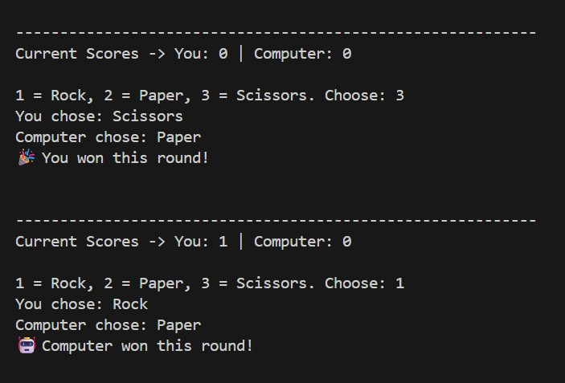
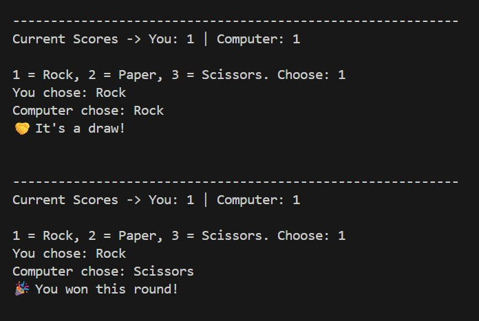
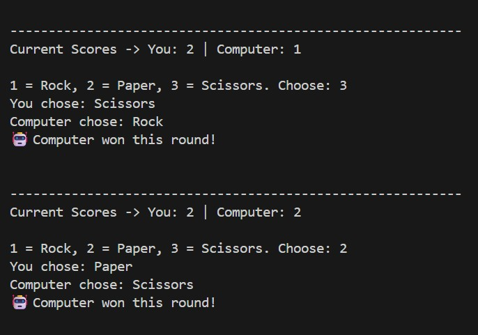
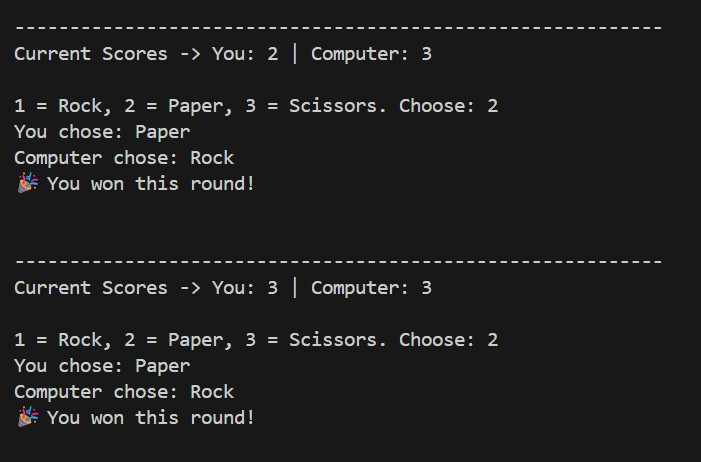
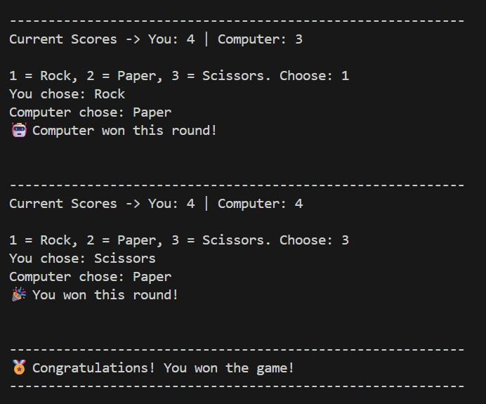

# Rock–Paper–Scissors CLI Game

A beginner-friendly, fully interactive **Python command-line game** where the player competes against the computer in the classic Rock–Paper–Scissors match. The program validates inputs, tracks scores, and the first to reach **5 points** wins the game.

---

## 🎯 Features

* ✔ CLI-friendly interface  
* ✔ Input validation (numbers only)  
* ✔ Random computer selection  
* ✔ Win / Lose / Draw logic  
* ✔ Score tracking  
* ✔ First to 5 points wins  
* ✔ Clean, readable Python code  

---

## 📸 Demo / Screenshots

Here are screenshots of the game running:







---

## 🚀 How to Run

Make sure Python is installed.

```bash
python stone_paper.py
```

---

## 📂 Project Structure

```
number-guessing-cli/
│── stone_paper.py
│── README.md
│── terminal-1.jpg
│── terminal-2.jpg
│── terminal-3.jpg
│── terminal-4.jpg
└── terminal-5.jpg
```


---

## 🧠 Game Logic (Summary)

1. User chooses 1 = Rock, 2 = Paper, or 3 = Scissors.
2. Computer randomly picks a move.
3. Game applies RPS rules:
    * Rock beats Scissors.
    * Scissors beats Paper.
    * Paper beats Rock.
4. Winner gets 1 point.
5. First to 5 points wins the match.
6. Game shows detailed messages for each round.
  
---

## 📝 Code Used

```python
import random 

cscore = 0      # Computer Score
hscore = 0      # Human Score

while True:

    print("\n-----------------------------------------------------------")
    print(f"Current Scores -> You: {hscore} | Computer: {cscore}\n")
    user = input("1 = Rock, 2 = Paper, 3 = Scissors. Choose: ")

    # Check if input is a number
    if not user.isdigit(): 
        print("Invalid input! Please enter a number only.\n")
        continue

    user = int(user)

    # Validate input range
    if user < 1 or user > 3: 
        print("⚠ Please enter a number **between 1 and 3 only.**\n")
        continue
    
    com = random.randint(1,3)

    # Display moves
    moves = ["Rock", "Paper", "Scissors"]

    # This list stores the names of moves.
    # User enters 1,2,3 but Python list indexes start at 0.
    # So (user - 1) gives the correct move name from the list.

    print(f"You chose: {moves[user-1]}")            
    print(f"Computer chose: {moves[com-1]}")

    # -----------------------
    # 🔥 RPS Logic 
    # -----------------------

    if user == com:
        print("🤝 It's a draw!\n")

    elif (user == 1 and com == 3) or \
         (user == 2 and com == 1) or \
         (user == 3 and com == 2):
        hscore += 1
        print("🎉 You won this round!\n")

    else:
        cscore += 1
        print("🤖 Computer won this round!\n")
    

    # -----------------------
    # 🔥 Win condition  
    # -----------------------
    if cscore == 5:
        print("\n-----------------------------------------------------------")
        print("👿 Computer won this game!")
        print("-----------------------------------------------------------\n")
        break
    elif hscore == 5:
        print("\n-----------------------------------------------------------")
        print("🏅 Congratulations! You won the game!")
        print("-----------------------------------------------------------\n")
        break
```


